# CarbonCast: Development's Carbon Cost  
**Predicting National CO₂ Trajectories Through Socioeconomic Indicators**  
*Machine Learning Model with 98% R² Accuracy*

[](https://github.com/realyashagarwal/Climate_Change)
[](https://git-lfs.com)
[](https://python.org)
[](LICENSE)

## 🌍 Overview

CarbonCast is a machine learning project that predicts national CO₂ emission trajectories using socioeconomic indicators. By analyzing World Bank climate data, this model achieves 98% accuracy in forecasting how countries' carbon footprints will evolve based on their development patterns.

## 🔄 Project Workflow

```mermaid
graph LR
    A[climate_change_download_0.xls] -->|Processed in| B(1-Data_Preprocessing.ipynb)
    B --> C[data_cleaned.csv]
    C --> D(2-Exploratory_Data_Analysis.ipynb)
    D -->|Insights| E(3-Model_Training_and_Future_Forecasting.ipynb)
    E --> F[Trained-Model.pkl]
    F --> G[CO₂ Predictions]
```



## 🔍 Key Findings

### 1. **Socioeconomic Drivers Matter**
Top features predicting CO₂ emissions:
```python
['Cereal_yield', 'Protected_land', 'Energy_use_percap', 
 'Urban_population_percent', 'Population_growth']
```

### 2. **India's Projected Growth**
| Year | CO₂ per Capita | Change vs 2024 |
|------|----------------|-----------------|
| 2024 | 2.19t          | Baseline        |
| 2028 | 2.56t          | +16.5%          |

### 3. **Global Divergence**
```diff
+ Developed: Emissions down 1.2%/yr (e.g., USA)
- Developing: Emissions up 4.3%/yr (e.g., India)
```

## 📂 Project Structure

```
CarbonCast/
├── 1-Data_Preprocessing.ipynb           # Data cleaning and preprocessing
├── 2-Exploratory_Data_Analysis.ipynb   # CAGR analysis & visualizations
├── 3-Model_Training_and_Future_Forecasting.ipynb  # Model training & predictions
├── Trained-Model.pkl                    # Serialized ML model (Git LFS)
├── data_cleaned.csv                     # Processed dataset
├── climate_change_download_0.xls        # Original World Bank data
├── .gitattributes                       # Git LFS configuration
├── requirements.txt                     # Python dependencies
└── README.md                           # This file
```

## ⚙️ Setup & Installation

### Prerequisites
- Python 3.8 or higher
- Git with Git LFS support
- Jupyter Notebook or JupyterLab

### Installation Steps

1. **Clone repository** (with Git LFS):
```bash
git lfs install
git clone https://github.com/realyashagarwal/Climate_Change.git
cd Climate_Change
```

2. **Install dependencies**:
```bash
pip install -r requirements.txt
```
Or manually install:
```bash
pip install pandas numpy scikit-learn matplotlib seaborn statsmodels jupyter
```

3. **Launch Jupyter**:
```bash
jupyter notebook
```

## 🚀 Usage

Run the notebooks in the following order:

1. **Data Preprocessing**: `1-Data_Preprocessing.ipynb`
   - Cleans raw Excel data
   - Handles missing values and outliers
   - Outputs `data_cleaned.csv`

2. **Exploratory Data Analysis**: `2-Exploratory_Data_Analysis.ipynb`
   - Performs CAGR analysis
   - Creates trend visualizations
   - Identifies key patterns

3. **Model Training**: `3-Model_Training_and_Future_Forecasting.ipynb`
   - Trains machine learning model
   - Generates predictions
   - Saves model as `Trained-Model.pkl`

## 📊 Model Performance

```python
# Model Metrics
R² Score: 0.98
Test Size: 1,181 observations
Key Features: Cereal yield, Energy use, Urban population
Cross-validation Score: 0.96 ± 0.02
```

## 💡 Key Insights

- **Economic Growth ≠ Emissions Growth**: Russia showed +7.41% GNI growth with -0.61% energy use
- **Agricultural Efficiency**: Pakistan achieved +2.29% cereal yield CAGR (1991-2008)
- **Conservation Progress**: India increased protected land by +0.35% annually
- **Urbanization Impact**: Urban population percentage strongly correlates with per-capita emissions

## 📈 Sample Predictions

```python
# Load trained model
import pickle
model = pickle.load(open('Trained-Model.pkl', 'rb'))

# Example prediction for a country
features = [cereal_yield, protected_land, energy_use, urban_pop, pop_growth]
co2_prediction = model.predict([features])
```

## 📚 Data Sources

- **Primary**: World Bank Climate Change Knowledge Portal
- **Variables**: 50+ socioeconomic indicators (1990-2020)
- **Coverage**: 195 countries and territories
- **Format**: Excel (.xls) → CSV processing pipeline

## 🛠️ Technical Stack

- **Data Processing**: Pandas, NumPy
- **Machine Learning**: Scikit-learn
- **Visualization**: Matplotlib, Seaborn
- **Statistical Analysis**: Statsmodels
- **Model Persistence**: Pickle
- **Version Control**: Git LFS for large files


## 📄 License

This project is licensed under the MIT License - see the [LICENSE](LICENSE) file for details.

## 👨‍💻 Author

**Yash Agarwal**
- GitHub: [@realyashagarwal](https://github.com/realyashagarwal)
- LinkedIn: [Connect with me](https://linkedin.com/in/realyashagarwal)

## 🙏 Acknowledgments

- World Bank for providing comprehensive climate data
- Open source community for excellent ML libraries
- Climate research community for domain insights

---

⭐ **Star this repository if you find it helpful!** ⭐
